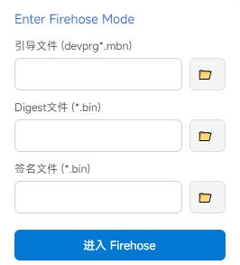
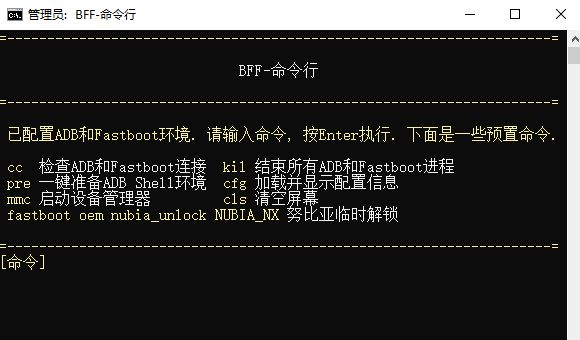
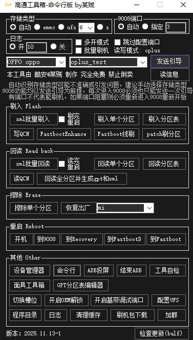

# Oplus-Qualcomm-Unlock-2026-Universal-Guide
[2026最新] OPPO/一加/真我全系高通机型解锁 Bootloader 教程。以 Find X6 Pro (x6p) 为例，配套工具通用于大多数高通机型 (除 X8U 外)，也提供了x7u的解锁资料。含 9008 免授权 (EDL No Auth) 及完整救砖解锁文件。
# 绿厂 8Gen2 系列新版解锁教程 (以 Find X6 Pro 为例)

> **⚠️ 严重警告：**
> **一加、真我、绿厂（OPPO）的高通机型用户，千万别更新系统！！！**
> * 几乎所有高通机型都可以免授权 9008，8 至尊及以下均支持（8 尊 5 未知）。
> * 其中绿厂 X7U、X6P、N3 以及其他老高通机型可以解锁 BL，X8U 虽然可以 9008 但暂不支持解锁。
> * **升级系统会导致该机 9008 免授权被永久熔断，且降级无效！**
> * 升级过 9 月补丁的骁龙 8+、778G、768G、865、870 机型，已经被熔断（865、870 的熔断版本可能更早）。
> * 就算你的机器已经停更也不能幸免，OPPO 还会特意推一个小更新来进行熔断，**被熔断后终身无法恢复**。
> * **对于欧加真玩机来说，9008 免授权非常重要，如果你的手机 OCDT 损坏（例如遭遇格机）售后无法帮你救砖，你必须拆字库才能救好。**

> **关于 9008 救砖：**
> 关于欧加免授权 9008 的详细描述，请看我的另一个仓库。
> 本文蓝奏云链接内附带有几乎所有可解机型的资料以及教程的链接，x7u资料也已经用另附链接补充。

---

本文以 x6p 为例，关于 x7u 解锁，这里有一些资料，由于我没有该机型，暂不提供更详细的指导。
[X7U 解锁资料备份 (Google Drive)](https://drive.google.com/file/d/1Wnkcm6HvBuT5AQvYedfRMFfjuJ3MwAUf/view?usp=drive_link)

*原作者酷安 @科技亮仔。由于酷安大量优质帖子无法在浏览器中搜索到，为了方便各位机友检索，故转载至 Github，感谢原作者对机圈做出的贡献。*

---

## 准备工作

本篇教程基于 **OPPO Find X6 Pro**
系统版本 **16.0.1.300**（低于该版本应该都可以）

首先就是准备工具：
* 请提前备份资料，**解锁会清空资料**
* **⚠️全分区备份也需要，保命用⚠️**
    * 可参考文献：[知乎：OPPO高通旧机型解锁指南](https://zhuanlan.zhihu.com/p/1911733731930116121)虽然x6p等8g2被熔断过一次，但这次又能免授权了，别更新系统就行。
* **手，脑子，一根十分好用的数据线**，还有一部需要解锁的手机，最后就是一台电脑

教程中需要准备的文件：**OPLUS EDL TOOL 高通工具箱**
需要的文件都在这：[点击下载 (蓝奏云)](https://www.ilanzou.com/s/rGUNAZq5)

接下来正文开始
--------------------------------------------分割线

### 第一步：下载好需要的文件

高通工具箱中驱动全部安装。

### 第二步：打开 OPLUS EDLTOOL 工具箱

* 引导文件选择网盘里面的 `v2.6` 或 `v2.7`
* Digest 文件选择后缀为 `ELF` 的 Digest 文件
* 签名文件则选择后缀为 `bin` 的 sign 文件
* 三个文件都选择成功后就可以下一步了

### 第三步：手机开启 usb 调试，oem 解锁

关于本机连续点击五次版本号进入开发者模式。

### 第四步：打开高通工具箱

打开高通工具箱，和高通工具箱中的命令行。

这两个都打开之后，用命令行版本，在手机开机状态下重启到 9008。

> **⚠️重点！！！**
> **这步需要先重启到 fastboot，但不让手机真的进入 fastboot，而是 9008，为下一步解锁做准备，这一步非常非常重要。**

**步骤：**
1.  在命令行输入 `adb reboot bootloader`
2.  **手机按住音量上下（手机是开机的）**
3.  然后插入数据线，按 enter 发送指令后，**马上回到 edl 工具，按下进入 firehose**（这个就是发送引导的作用）
4.  等待电脑提示音响起，此时 9008 模式应该已经连接上了，程序右侧 9008 端口显示 COMn（n 为端口数字）。
5.  点击读取分区表，如等待过后成功出现，则为成功进入 9008 模式。

### 第五步：刷入解锁文件

在分区表中找到 `abl_a` `abl_b` `ocdt`。

1.  其中双击分区，选择文件中的 `abl` / `ocdt` `unlock` 的文件，按对应选好后写入选中。
    * （建议一个一个刷，不确定是否可以同时刷好多个）
2.  全部刷好后便开启下一步。
3.  此时打开高通工具箱，点击重启 **roboot 开机**。
    * 如果不行那就手动来（强制开机：音量上和电源键同时按住）。

**此时如重启到 fastboot 便为成功**，如无限重启或开机了，那请按照教程，刷回原 `abl` `ocdt` 文件，全部重新来。

*此时请不要完全依赖手机显示，某些机器进入 fastboot 后可能表现为花屏或黑屏，请注意电脑是否有连接提示音或观看设备管理器。*

进入后请使用高通工具箱命令行 `fastboot devices` 检测是否连接。如出现一串字符，后面标注 `fastboot` 则为链接成功。

此时你就可以输入 `fastboot flashing unlock` 这串命令用于解锁 bl。

1.  手机会进入新的界面，具体为一堆英文，下面两个选项。
2.  请使用音量上下选择到 **UNLOCK THE BOOTLOADER**，选中后会高亮蓝色。
3.  之后点击电源键确定，此时你的手机会重启到 fastboot（x6pro 是这样，其他机器如果直接关机或开机了请进入 9008 模式，方案为关机状态长按音量上下并插入数据线）。

如果重启后回到 fastboot，那你可以使用 `fastboot getvar unlocked` 这个指令。
如果输出为“unlocked: yes”则已解锁，“unlocked: no”则未解锁。解锁失败可以返回上个步骤重试。

### 第六步：刷回原 abl ocdt 文件

**x6p 使用解锁时的 abl 和 ocdt 会导致开机无触摸**，如果不小心开机了请强制重启（音量上和电源键一起按）直到关机后立马按住音量上下，接入数据线进 9008。

1.  进入后按刷入解锁文件的方案一样，只不过刷入时选择的文件是**原系统的**。
2.  如果没备份可以找全量包，**但是不能找我⚠️**
3.  刷入之后便可以重启，进入系统。

此时你可以打开开发者模式查看 oem 解锁状态：

这样就是成功了。
接下来也就可以进行你的玩机人生了。

---

本教程使用绝大部份绿厂机器，但是仅通过 8gen2 的 x6p 进行测试其他未知，自行尝试。

工具不是我做的，大佬酷安我找不到了，有认识的可以艾特，我只是以一个玩机人的角度提供教程方便大家。

**有一些问题需要强调：**
有的人可能会遇到一些问题，比如正常模式下电脑连接正常，但是进入 fastboot 模式后电脑不连接，手机上也显示了 fastboot 模式，这时候你就要检测四个个东西：**接口，驱动，数据线，脑子**。

还有就是，以后会开始做 x6p 的第三方系统移植，可以到主页的组织期待哈。

到这里本篇教程也来到了尾声，感谢观看❤️谢谢你们，如果觉得有用，请关注原作者或给本仓库点个 Star，你们的支持是更新最大的动力哦。

感谢大佬提供热心指导：@某贼
